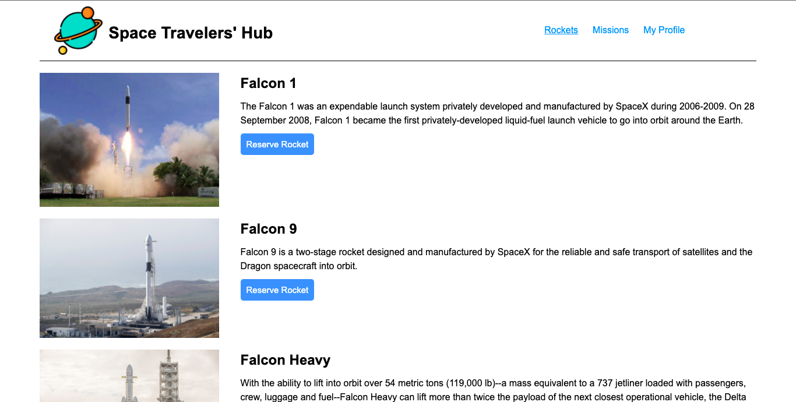
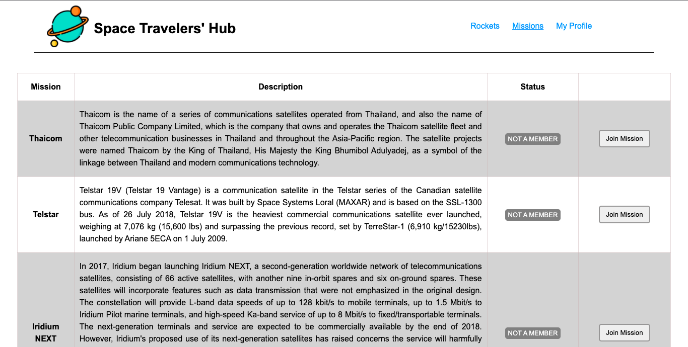

# Star Travellers

> A Web App that allows clients to book trips to the Stars and beyond.




- A User can view a list of all the available rockets and then reserve the rocket of their choice.
- A User can cancel a reserved rocket.
- A User can view a list of available missions and join a mission of their choice.
- A User can also cancel a chosen mission for reasons only known to them.
- A User can view a list of all their chosen Rockets and Missions on their profile page.

## Built With

- JSX, CSS
- React

<!-- ## Live Demo

- [Netlify](https://bookstore-react-redux.netlify.app/) -->

# Set Up
## Clone This Repository
```
$ git clone https://github.com/emmyobonyo/Star-Travellers-Hub.git
$ cd Star-Travellers-Hub
```

## Run Project
```
$ npm install
$ npm start
```

👤 **Emmanuel Obonyo**

- GitHub: [@emmyobonyo](https://github.com/emmyobonyo)
- Twitter: [@emmyobonyo](https://twitter.com/emmyobonyo)
- LinkedIn: [Emmanuel Obonyo](https://www.linkedin.com/in/emmanuel-obonyo-3728a2200/)
## 🤝 Contributing

Contributions, issues, and feature requests are welcome!

Feel free to check the [issues page](https://github.com/emmyobonyo/Math-Magiians-Raect/issues).

## Show your support

Give a ⭐️ if you like this project!
